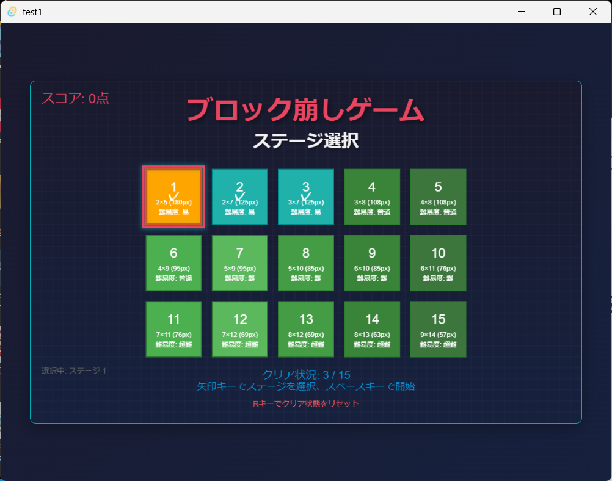
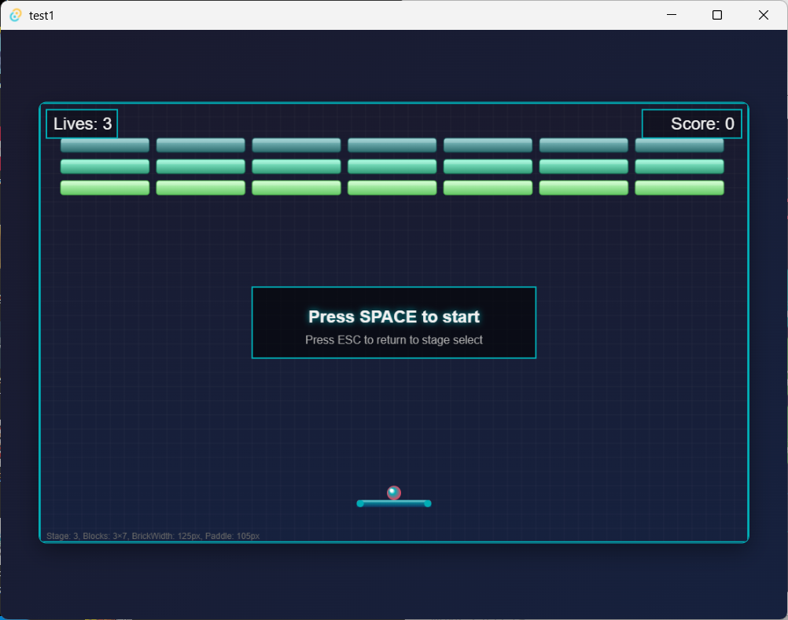

# ブロック崩しゲーム (Tauri + React + TypeScript)

このプロジェクトは、Tauri、React、TypeScriptを使用して構築されたブロック崩しゲームです。ゲームはブラウザ上で動作し、ステージ選択やスコア管理、ローカルストレージを活用した進行状況の保存機能を備えています。

## サムネイル




## 特徴

- **Tauri** を使用した軽量なデスクトップアプリケーション
- **React** によるモダンなUI設計
- **TypeScript** による型安全なコードベース
- ステージ選択機能（全15ステージ）
- スコアと進行状況のローカルストレージ保存
- 難易度に応じたブロック配置とゲームスピード
- カスタマイズ可能なデザインとアニメーション

## 必要な環境

- Node.js 18.x 以上
- Rust 1.65 以上
- Tauri CLI

## セットアップ

1. リポジトリをクローンします。

   ```bash
   git clone https://github.com/your-repo/block-breaker-game.git
   cd block-breaker-game
   ```

2. 必要な依存関係をインストールします。

   ```bash
   npm install
   ```

3. Rustの環境をセットアップします。

   ```bash
   rustup update
   ```

4. 開発サーバーを起動します。

   ```bash
   npm run tauri dev
   ```

5. ブラウザまたはTauriウィンドウでゲームをプレイできます。

## ビルド

アプリケーションをビルドするには、以下のコマンドを実行します。

```bash
npm run tauri build
```

ビルドされたアプリケーションは `src-tauri/target/release` ディレクトリに生成されます。

## ゲームの遊び方

1. アプリケーションを起動すると、ステージ選択画面が表示されます。
2. 矢印キーでステージを選択し、スペースキーでゲームを開始します。
3. パドルを左右に動かしてボールを跳ね返し、すべてのブロックを破壊してください。
4. ライフがなくなるとゲームオーバーになります。

## ライセンス

このプロジェクトは [MITライセンス](LICENSE) のもとで公開されています。